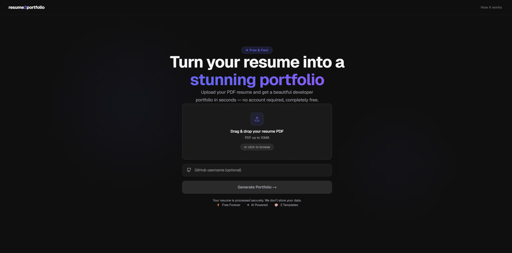
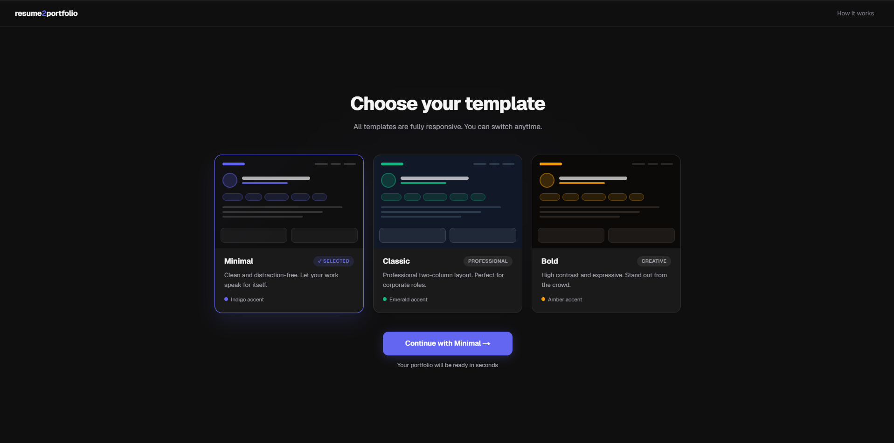
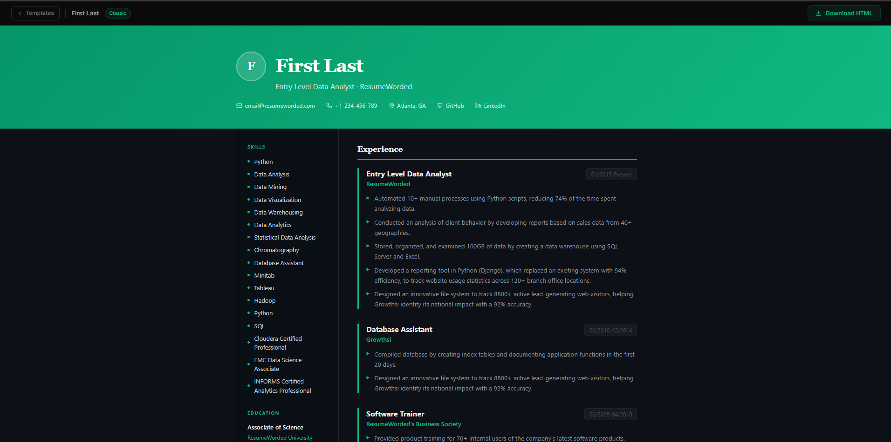

# resume2portfolio

**Turn your resume into a stunning developer portfolio in seconds.**

Upload a PDF resume → AI extracts your data → Pick a template → Download your portfolio.

🔗 **Live demo:** [resume-to-portfolio-alpha.vercel.app](https://resume-to-portfolio-alpha.vercel.app)

---

## Features

- **AI-powered extraction** — Powered by Llama 3.1 via Groq. Parses name, contact info, skills, experience, projects, education, certifications and languages from any PDF resume
- **GitHub enrichment** — Optionally provide your GitHub username to auto-pull repositories and contributions into your portfolio
- **3 professional templates** — Minimal (indigo), Classic (emerald), Bold (amber) — all fully responsive
- **Download as HTML** — Get a self-contained `.html` file you can host anywhere: GitHub Pages, Netlify, or send directly
- **No account required** — Just upload and go. We don't store your data
- **Free forever** — Runs on Groq's free tier (14,400 requests/day)

---

## Screenshots

> Landing page → Template picker → Portfolio (Minimal, Classic, Bold)

<!-- Add screenshots here after taking them -->



---

## Tech Stack

| Layer | Technology |
|---|---|
| Frontend | Next.js 14, TypeScript, Tailwind CSS |
| Backend | Python, FastAPI |
| PDF Parsing | pdfplumber, PyMuPDF |
| LLM | Llama 3.1 via Groq API (cloud) or Ollama (local) |
| GitHub API | REST + GraphQL |
| Deployment | Vercel (frontend) + Render (backend) |

---

## Running Locally

### Prerequisites

- Node.js 18+
- Python 3.11+
- [Ollama](https://ollama.com) installed (for local LLM) **or** a free [Groq API key](https://console.groq.com)

### 1. Clone the repo

```bash
git clone https://github.com/yourusername/resume-to-portfolio.git
cd resume-to-portfolio
```

### 2. Set up the backend

```bash
cd backend
pip install -r requirements.txt
```

Create a `.env` file in the project root:

```env
# Choose your LLM provider
LLM_PROVIDER=ollama        # or "groq" for cloud

# Ollama (local) — used when LLM_PROVIDER=ollama
OLLAMA_MODEL=llama3.1
OLLAMA_BASE_URL=http://localhost:11434

# Groq (cloud) — used when LLM_PROVIDER=groq
# Get your free key at https://console.groq.com
GROQ_API_KEY=
GROQ_MODEL=llama-3.1-8b-instant

# GitHub enrichment (optional)
# Scopes needed: read:user, public_repo
GITHUB_TOKEN=

# Frontend URL for CORS
FRONTEND_URL=http://localhost:3000
```

Start the backend:

```bash
uvicorn api:app --reload --port 8000
```

### 3. Set up the frontend

```bash
cd frontend
npm install
```

Create `frontend/.env.local`:

```env
NEXT_PUBLIC_API_URL=http://localhost:8000
```

Start the frontend:

```bash
npm run dev
```

Visit [http://localhost:3000](http://localhost:3000)

---

## Using Ollama (fully local, no API key)

```bash
# Pull the model (one-time, ~4.7GB)
ollama pull llama3.1

# Make sure Ollama is running
ollama serve
```

Set `LLM_PROVIDER=ollama` in your `.env` and the app runs 100% offline.

---

## Deployment

### Backend → Render

1. Create a new **Web Service** on [render.com](https://render.com)
2. Connect your GitHub repo
3. Set these options:

| Field | Value |
|---|---|
| Root Directory | `backend` |
| Build Command | `pip install -r requirements.txt` |
| Start Command | `uvicorn api:app --host 0.0.0.0 --port $PORT` |

4. Add environment variables:
```
LLM_PROVIDER=groq
GROQ_API_KEY=your_key
GROQ_MODEL=llama-3.1-8b-instant
FRONTEND_URL=https://your-app.vercel.app
```

### Frontend → Vercel

1. Import your repo on [vercel.com](https://vercel.com)
2. Set Root Directory to `frontend`
3. Add environment variable:
```
NEXT_PUBLIC_API_URL=https://your-api.onrender.com
```

---

## Project Structure

```
resume-to-portfolio/
├── backend/
│   ├── api.py              # FastAPI endpoints
│   ├── pipeline.py         # Orchestration
│   ├── extractor.py        # LLM extraction (Ollama + Groq)
│   ├── parser.py           # PDF text extraction
│   ├── github_enricher.py  # GitHub API integration
│   └── requirements.txt
├── frontend/
│   └── app/
│       ├── page.tsx                    # Landing page
│       ├── templates/page.tsx          # Template picker
│       ├── portfolio/page.tsx          # Portfolio renderer + download
│       ├── how-it-works/page.tsx       # How it works
│       └── components/
│           ├── Navbar.tsx
│           ├── UploadForm.tsx
│           └── templates/
│               ├── Minimal.tsx
│               ├── Classic.tsx
│               └── Bold.tsx
└── .env.example
```

---

## Roadmap

- [ ] Edit mode — tweak extracted data before generating
- [ ] More templates
- [ ] Persistent portfolios with shareable URLs
- [ ] One-click deploy to GitHub Pages
- [ ] Custom domain support

---

## License

MIT
